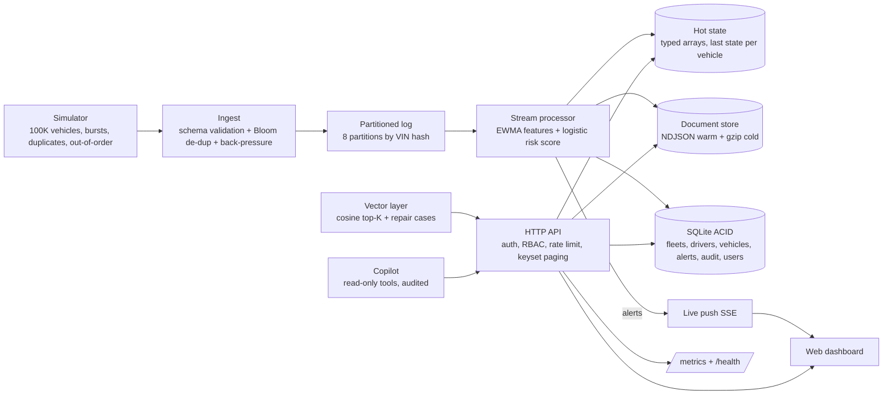
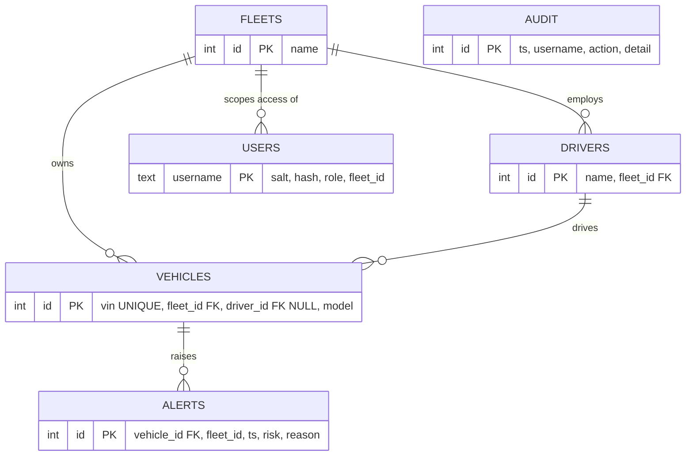

# FleetPulse design

## Architecture

## ER diagram (3NF relational core)

Deliberate denormalisation: `alerts.fleet_id` repeats the vehicle's fleet so per-fleet alert queries use one index (`idx_alert_fleet`) without a join.

## Which data lives where
| Data | Store | Why |
|---|---|---|
| Fleets, drivers, vehicles, users, alerts, audit | SQLite (relational, ACID) | Ownership, access and audit need transactions and constraints |
| Latest state per vehicle, risk scores | In-memory typed arrays (hot) | Sub-millisecond reads for the live map; rebuilt from the stream |
| Raw fault and harsh-brake events, 1 in 50 ordinary events | NDJSON document store | Schemaless, append-only, OEM formats change often |
| Old raw events | gzip files (cold) | About 8x smaller, cheap, deleted by retention |
| Fault-signature embeddings and repair cases | Vector layer (cosine, brute force) | Retrieves "what fixed vehicles like this" for the copilot |

Production mapping: SQLite -> PostgreSQL, hot arrays -> Redis, NDJSON -> Cassandra/MongoDB + S3 Parquet, brute-force vectors -> pgvector or Qdrant, partitioned log -> Kafka.

## CAP and PACELC
| Data | Choice | Reason |
|---|---|---|
| Users, ownership, alerts, audit | CP (single ACID store) | Wrong access or lost audit is worse than a short outage. PACELC: PC/EC, pay latency for consistency |
| Telemetry, hot state | AP (eventual) | A slightly stale position is fine, dropping events is not. PACELC: PA/EL |
| Dedupe | AP with approximate answer | Bloom filter may rarely treat a new event as a duplicate (under 1% measured in tests) |

## Data lifecycle and cost estimate (assumptions in brackets)
| Tier | Content | Retention | Volume |
|---|---|---|---|
| Hot | Last state per vehicle | Live | 100K x ~150 B = about 15 MB |
| Warm | NDJSON segments | 3 minutes in the demo, configurable (7 days in production) | [about 5% of 8.6 TB/day kept] = about 430 GB/day |
| Cold | gzip segments | 1 hour in the demo (30 days in production) | [8x compression] = about 54 GB/day, 1.6 TB for 30 days |

Estimated cold cost on object storage at [USD 0.023 per GB-month]: about USD 37 per month. These are estimates, not measurements.

## Algorithms and complexity
| Algorithm | Where | Complexity |
|---|---|---|
| Bloom filter (3 hashes) | De-duplication | O(k) per event, 8 MB fixed memory |
| EWMA features | Stream scoring | O(1) per event |
| Logistic regression | Risk model | Training O(epochs x n x d), scoring O(d) |
| Keyset pagination | At-risk list | O(N + m log m) per page, stable under inserts, no OFFSET |
| Cosine top-K (brute force) | Similar vehicles | O(M x d) for M candidates |
| Offset-indexed reads | Vehicle history | O(1) per event, no file scan |
| Batch scan | Analytics | O(stored events) |
| Partition by VIN hash | Log | O(1), even spread, ordered per vehicle |

SQL optimisation (`npm run explain`, 500,000 alert rows): `SCAN alerts + TEMP B-TREE` at about 15 ms became `SEARCH ... USING INDEX idx_alert_fleet_risk` at about 0.03 ms.

## Principles covered
Idempotency (dedupe by vin+seq), at-least-once delivery with dedupe (effectively once), back-pressure (partition cap), graceful degradation (throttle instead of crash), horizontal scaling story (more partitions and consumers), cache-style hot state, tenant isolation (fleet scope on every query), location masking and erasure.
